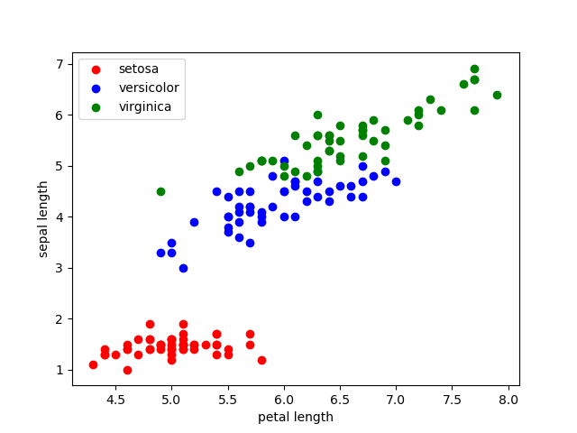
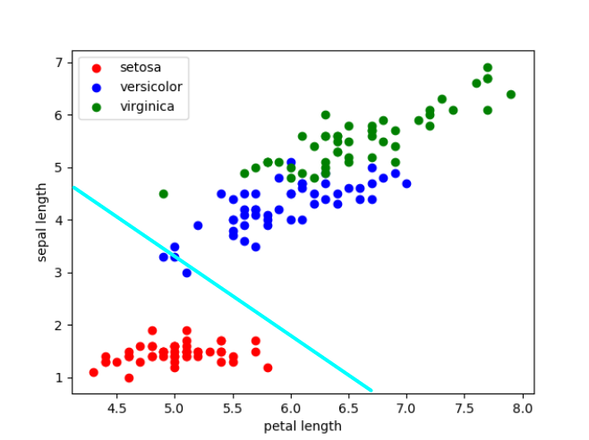

# Iris Neural Network

## Installation
For the first step it's necessary install all python requirements, using:
```
pip install -r requirements.txt
```

## Tests
For the run tests, just run the file with suffix test_, e.g. `src/onsklearn/test_perceptron_multi_layer.py`:
```
py src/onsklearn/test_<file>.py
```

If you wish run the visual tests, just run the file without test_ suffix:
```
py src/onsklearn/<file>.py
```

## Visual tests
After runs the file perceptron, the return must be as:

### Setosa from Virginica 
This example utilizes the Linear Perceptron, according this show belown.
```
  # py src/onsklearn/perceptron_linear.py
  with [5.  3.2 1.2 0.2] is expected setosa and was returned setosa
  with [5.5 3.5 1.3 0.2] is expected setosa and was returned setosa
  with [4.9 3.1 1.5 0.1] is expected setosa and was returned setosa
  with [4.4 3.  1.3 0.2] is expected setosa and was returned setosa
  with [5.1 3.4 1.5 0.2] is expected setosa and was returned setosa
  with [5.  3.5 1.3 0.3] is expected setosa and was returned setosa
  with [4.5 2.3 1.3 0.3] is expected setosa and was returned setosa
  with [4.4 3.2 1.3 0.2] is expected setosa and was returned setosa
  with [5.  3.5 1.6 0.6] is expected setosa and was returned setosa
  with [5.1 3.8 1.9 0.4] is expected setosa and was returned setosa
  with [4.8 3.  1.4 0.3] is expected setosa and was returned setosa
  with [5.1 3.8 1.6 0.2] is expected setosa and was returned setosa
  with [4.6 3.2 1.4 0.2] is expected setosa and was returned setosa
  with [5.3 3.7 1.5 0.2] is expected setosa and was returned setosa
  with [5.  3.3 1.4 0.2] is expected setosa and was returned setosa
  with [7.7 3.  6.1 2.3] is expected virginica and was returned virginica
  with [6.3 3.4 5.6 2.4] is expected virginica and was returned virginica
  with [6.4 3.1 5.5 1.8] is expected virginica and was returned virginica
  with [6.  3.  4.8 1.8] is expected virginica and was returned virginica
  with [6.9 3.1 5.4 2.1] is expected virginica and was returned virginica
  with [6.7 3.1 5.6 2.4] is expected virginica and was returned virginica
  with [6.9 3.1 5.1 2.3] is expected virginica and was returned virginica
  with [5.8 2.7 5.1 1.9] is expected virginica and was returned virginica
  with [6.8 3.2 5.9 2.3] is expected virginica and was returned virginica
  with [6.7 3.3 5.7 2.5] is expected virginica and was returned virginica
  with [6.7 3.  5.2 2.3] is expected virginica and was returned virginica
  with [6.3 2.5 5.  1.9] is expected virginica and was returned virginica
  with [6.5 3.  5.2 2. ] is expected virginica and was returned virginica
  with [6.2 3.4 5.4 2.3] is expected virginica and was returned virginica
  with [5.9 3.  5.1 1.8] is expected virginica and was returned virginica
```

### Virginica from Versicolor
This example utilizes the Multilayer Perceptron, according this show belown too.
```
  # py src/onsklearn/multilayer_linear.py
  with [6.  3.4 4.5 1.6] is expected versicolor and was returned versicolor
  with [6.7 3.1 4.7 1.5] is expected versicolor and was returned versicolor
  with [6.3 2.3 4.4 1.3] is expected versicolor and was returned versicolor
  with [5.6 3.  4.1 1.3] is expected versicolor and was returned versicolor
  with [5.5 2.5 4.  1.3] is expected versicolor and was returned versicolor
  with [5.5 2.6 4.4 1.2] is expected versicolor and was returned versicolor
  with [6.1 3.  4.6 1.4] is expected versicolor and was returned versicolor
  with [5.8 2.6 4.  1.2] is expected versicolor and was returned versicolor
  with [5.  2.3 3.3 1. ] is expected versicolor and was returned versicolor
  with [5.6 2.7 4.2 1.3] is expected versicolor and was returned versicolor
  with [5.7 3.  4.2 1.2] is expected versicolor and was returned versicolor
  with [5.7 2.9 4.2 1.3] is expected versicolor and was returned versicolor
  with [6.2 2.9 4.3 1.3] is expected versicolor and was returned versicolor
  with [5.1 2.5 3.  1.1] is expected versicolor and was returned versicolor
  with [5.7 2.8 4.1 1.3] is expected versicolor and was returned versicolor
  with [7.7 3.  6.1 2.3] is expected virginica and was returned virginica
  with [6.3 3.4 5.6 2.4] is expected virginica and was returned virginica
  with [6.4 3.1 5.5 1.8] is expected virginica and was returned virginica
  with [6.  3.  4.8 1.8] is expected virginica and was returned virginica
  with [6.9 3.1 5.4 2.1] is expected virginica and was returned virginica
  with [6.7 3.1 5.6 2.4] is expected virginica and was returned virginica
  with [6.9 3.1 5.1 2.3] is expected virginica and was returned virginica
  with [5.8 2.7 5.1 1.9] is expected virginica and was returned virginica
  with [6.8 3.2 5.9 2.3] is expected virginica and was returned virginica
  with [6.7 3.3 5.7 2.5] is expected virginica and was returned virginica
  with [6.7 3.  5.2 2.3] is expected virginica and was returned virginica
  with [6.3 2.5 5.  1.9] is expected virginica and was returned virginica
  with [6.5 3.  5.2 2. ] is expected virginica and was returned virginica
  with [6.2 3.4 5.4 2.3] is expected virginica and was returned virginica
  with [5.9 3.  5.1 1.8] is expected virginica and was returned virginica
```

## Graphic visualization
If you wish generate the graphic of decision region from dataset specified, just run:
```
py src/onsklearn/visualization.py
```

## Explanation
The first step is get the graphic of decision region from dataset. And got this:


### Setosa from Virginica

### Virginica from Versicolor


With the graphic generated, it's possible notice that the dataset diff between setosa and virginica is not linear, instead of virginica from versicolor that according we can see is a linear graphic. It's importante notice that the diff from virginica and versicolor are more difficult to distinguish. 

### Linear Perceptron
The [Linear Perceptron](https://en.wikipedia.org/wiki/Perceptron) is an algorithm linear classifier, therefore the dataset fitted must be linearly separable. According to shown below, the algorithm function work with binary options, and nothing besides that. Thus, we can observe that a possible implementation for "Setosa from Virginica" can be this classifier.

### MultiLayer Perceptron
Different of Linear Perceptron the [MultiLayer Perceptron](https://en.wikipedia.org/wiki/Multilayer_perceptron) is a feedforward artificial neural network, that way this classifier uses multiple layers of the perceptrons.

This perceptron normally has three node's layer, a layer for input, hidden and output. The nodes (except for the input) uses a non linear function and uses a supervisioned technique (backpropagation for training). With this, the Multilayer Perceptron can distinguish data even when they are not linearly separated.